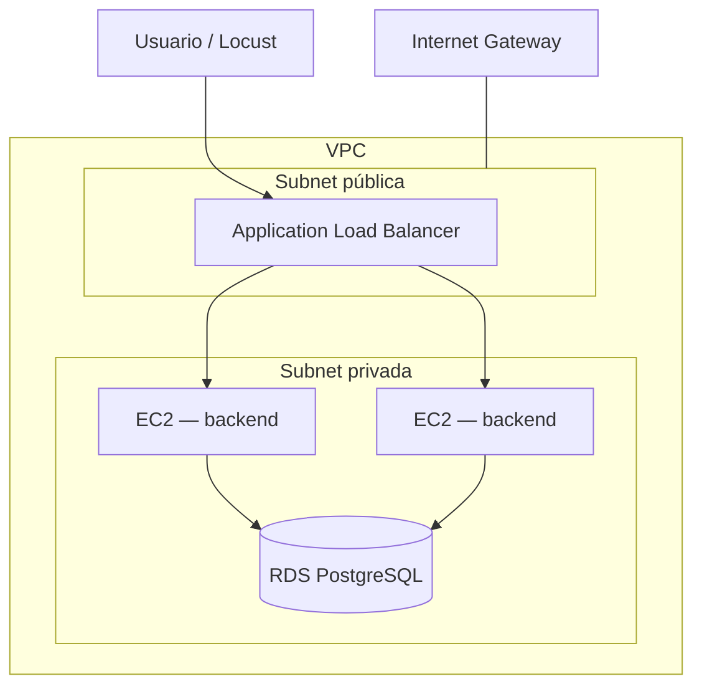

# OpsWatch — Terraform (AWS)

Diseño conceptual para desplegar OpsWatch en AWS con Terraform. No hay manifests implementados aún; este documento define la arquitectura, los recursos y el plan de aprovisionamiento.

## Objetivo

Ejecutar el **mismo backend** (imagen Docker Hub) en AWS con infraestructura reproducible, en paralelo al stack local:

| Capa | Local (K8s) | AWS (Terraform) |
|------|-------------|-----------------|
| Entrada | Ingress / port-forward | **ALB** |
| Compute | Deployment + HPA | **ASG + EC2** |
| Datos | Postgres en cluster | **RDS PostgreSQL** |
| Red | Namespace | **VPC + subnets** |
| Carga | Locust | Locust → ALB |

La app no cambia: Express expone `/api`, `/health` y `/metrics` con `DATABASE_URL` apuntando a PostgreSQL.

---

## Arquitectura



**Flujo de tráfico:** internet → ALB (público) → EC2 en subnet privada → RDS (solo desde EC2).

**Nota:** Se usa **VPC** (red virtual). VPN (acceso remoto privado) es opcional y queda fuera del alcance inicial.

---

## Recursos AWS

| Recurso | Rol |
|---------|-----|
| **VPC** | Red aislada `10.0.0.0/16` |
| **Subnets** | Pública (ALB) + privadas (EC2, RDS) en 2 AZ |
| **Internet Gateway** | Salida/entrada a internet para subnet pública |
| **NAT Gateway** | Salida a internet para EC2 privadas (pull Docker Hub) |
| **ALB** | Punto de entrada HTTP; rules `/api`, `/health`, `/metrics` |
| **Target Group** | Registra instancias EC2 del ASG |
| **ASG** | Min 2, max N instancias; scaling por CPU |
| **EC2** | Amazon Linux 2; Docker + imagen `opswatch-backend` |
| **RDS** | PostgreSQL 16; subnet privada, sin acceso público |
| **Security Groups** | ALB → EC2 → RDS (capas) |
| **IAM** | Role EC2 para logs/SSM (opcional ECR) |
| **S3 + DynamoDB** | Backend remoto de state Terraform (lock) |

---

## Security Groups

| SG | Entrada | Salida |
|----|---------|--------|
| **alb-sg** | 80/443 desde `0.0.0.0/0` (o IP restringida) | Puerto app → `ec2-sg` |
| **ec2-sg** | Puerto 3001 solo desde `alb-sg` | 5432 → `rds-sg`; 443 salida (NAT) |
| **rds-sg** | 5432 solo desde `ec2-sg` | — |

Sin reglas directas de internet hacia EC2 ni RDS.

---

## Estructura Terraform propuesta

```
terraform/
├── README.md                 # este archivo
├── environments/
│   └── dev/
│       ├── main.tf           # ensambla módulos
│       ├── variables.tf
│       ├── outputs.tf
│       ├── terraform.tfvars
│       └── backend.tf        # S3 state
└── modules/
    ├── vpc/
    ├── security/
    ├── alb/
    ├── asg/
    └── rds/
```

---

## Módulos (responsabilidad)

### `vpc`
- VPC, subnets públicas/privadas (2 AZ), IGW, NAT Gateway, route tables.

### `security`
- Security groups ALB, EC2 y RDS.
- Outputs: IDs para otros módulos.

### `alb`
- Application Load Balancer (público).
- Target group (puerto 3001, health check `/health`).
- Listener HTTP 80 → target group.

### `asg`
- Launch template: AMI, instance type, SG EC2, **user_data** (instalar Docker, pull imagen, `docker run` con `DATABASE_URL`).
- Auto Scaling Group en subnets privadas.
- Scaling policy por CPU (target ~70%, análogo al HPA).
- Min **2**, max **10** (ajustable; 20 en laptop local no siempre es viable en cloud sin costo).

### `rds`
- `db.t3.micro` PostgreSQL 16 (free tier).
- Subnet group en subnets privadas.
- Credenciales vía variables / Secrets Manager (no hardcodear en repo).

---

## Variables principales

| Variable | Ejemplo | Uso |
|----------|---------|-----|
| `aws_region` | `us-east-1` | Región |
| `project_name` | `opswatch` | Prefijo de recursos |
| `environment` | `dev` | Tags |
| `instance_type` | `t3.small` | EC2 |
| `db_instance_class` | `db.t3.micro` | RDS |
| `db_name` | `opswatch` | Base de datos |
| `db_username` | `postgres` | RDS user |
| `db_password` | *(secret)* | RDS password |
| `backend_image` | `tomaswajnerman/opswatch-backend:latest` | Docker Hub |
| `asg_min` / `asg_max` | `2` / `10` | Réplicas |

---

## Flujo de aprovisionamiento

```bash
cd terraform/environments/dev

# 1. Bucket S3 + tabla DynamoDB para state (una vez, manual o módulo bootstrap)
terraform init

# 2. Revisar plan
terraform plan -var="db_password=..."

# 3. Crear infra
terraform apply -var="db_password=..."

# 4. Outputs
terraform output alb_url
```

**Post-deploy:**
1. Abrir `http://<alb_url>/health` → debe responder OK.
2. Locust: `TARGET_HOST=http://<alb_url>` (sin port-forward).
3. Grafana local scrapea métricas si expones `/metrics` vía ALB o port-forward temporal.

---

## User data (concepto EC2)

Script en el launch template:

1. Instalar Docker.
2. Exportar `DATABASE_URL=postgresql://user:pass@<rds_endpoint>:5432/opswatch`.
3. `docker pull` + `docker run -p 3001:3001` con env vars.
4. Health check del target group valida `/health`.

El frontend puede quedar en local/K8s o agregarse después (S3 + CloudFront).

---

## Paralelo con el stack actual

| Acción | K8s local | AWS |
|--------|-----------|-----|
| Desplegar app | `kubectl apply -f k8s/` | `terraform apply` |
| Escalar | HPA + Locust | ASG policy + Locust → ALB |
| Observabilidad | `monitoring/` compose | Prometheus/Grafana local scrapeando ALB |
| Base de datos | Postgres StatefulSet | RDS PostgreSQL |

---

## Costos y limpieza

Recursos con costo recurrente: **ALB**, **NAT Gateway**, **RDS**, **EC2**.

```bash
terraform destroy -var="db_password=..."
```

Usar cuenta de prueba, tags y budget alarm. Destruir cuando no se use.

---

## Alcance v1 vs fase 2

| v1 (MVP curso) | Fase 2 |
|----------------|--------|
| VPC + ALB + ASG + RDS | HTTPS (ACM + listener 443) |
| Backend solo en EC2 | Frontend en S3/CloudFront |
| State en S3 | Secrets Manager para DB |
| ALB público | Client VPN + ALB interno |
| Docker Hub | ECR + pipeline |

---

## Prerrequisitos

- Cuenta AWS con permisos IAM
- AWS CLI configurado
- Terraform >= 1.5
- Imagen publicada en Docker Hub (`ci-cd.yml` ya la genera)

---

## Referencias en este repo

- App y compose local: `README.md` (raíz)
- Kubernetes + HPA: `k8s/README.md`
- Métricas: `monitoring/README.md`
- Carga: `load-testing/README.md`
